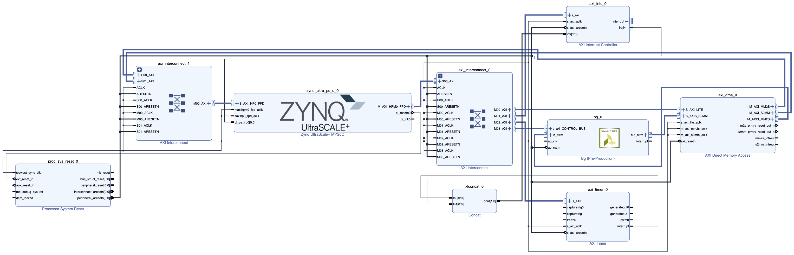
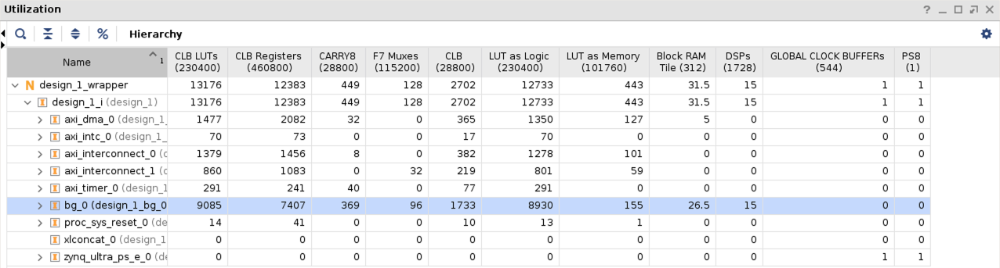

# An FPGA-Based Fully Pipelined Bilateral Grid for Real-Time Image Denoising

Copyright 2022, Nobuho Hashimoto and Shinya Takamaeda-Yamazaki


# License

[Apache License 2.0](http://www.apache.org/licenses/LICENSE-2.0)


# Publication

If you use this project in your research, please cite our paper.

```
@INPROCEEDINGS{9556446,
    author    = {Hashimoto, Nobuho and Takamaeda-Yamazaki, Shinya},
    booktitle = {2021 31st International Conference on Field-Programmable Logic and Applications (FPL)},
    title     = {{An FPGA-Based Fully Pipelined Bilateral Grid for Real-Time Image Denoising}},
    year      = {2021},
    volume    = {},
    number    = {},
    pages     = {167-173},
    doi       = {10.1109/FPL53798.2021.00035}
}
```

For further information on our paper, you can view the following materials.

- [Program and Abstract](https://whova.com/embedded/session/kScht29Q8lAG98UvGiEh7UVYTNeJssTMevISW%407S-oU%3D/1837318/)
- [Paper (IEEE Xplore)](https://ieeexplore.ieee.org/document/9556446)
- [Paper (arXiv)](https://arxiv.org/abs/2110.07186)
- [Papers With Code](https://cs.paperswithcode.com/paper/an-fpga-based-fully-pipelined-bilateral-grid-for-real-time-image-denoising)
- [Slides](https://speakerdeck.com/hashi0203/an-fpga-based-fully-pipelined-bilateral-grid-for-real-time-image-denoising-fpl-2021)
- [Movie](https://youtu.be/q5lxi7N-uX8)


# Summary

We proposed a **real-time image denoising system that uses an FPGA based on the bilateral grid (BG)**. In the BG, a 2D image consisting of x- and y-axes is projected onto a 3D space called a "grid," which consists of axes that correlate to the x-component, y-component, and intensity value of the input image. This grid is then blurred using the Gaussian filter, and the output image is generated by interpolating the grid. Although it is possible to change the window size in the BF, it is impossible to change it on the input image in the BG. Thus, we propose a BG with a variable-sized window by introducing the window radius parameter wherein the window radius on the grid is always 1. We then implement this BG on an FPGA in a fully pipelined manner. Further, we verify that our design **suppresses the increase in hardware resources even when the window size is enlarged** and **outperforms the existing designs in terms of computation speed and hardware resources**.


# Procedure

1. Prepare source codes
1. Export HDL using Vivado HLS
1. Generate bitstream using Vivado
1. Execute this design on ZCU104
1. Evaluate results

Note: If you just want to execute and evaluate this design, move to `4. Execute this design on ZCU104`.


## Settings

### 1st

- Python 3.8.5
- g++ (Ubuntu 9.3.0-17ubuntu1~20.04) 9.3.0


### 2nd

- Vivado HLS v2019.2


### 3rd

- Vivado v2019.2


### 4th and 5th

- **ZCU104** board with Zynq UltraScale+ MPSoC XCZU7EV-2FFVC1156 from Xilinx
    - PYNQ Linux 2.6, based on Ubuntu 18.04 (GNU/Linux 5.4.0-xilinx-v2020.1 aarch64)


## 1. Prepare source codes

You can **skip this section if you don't have to change parameter settings**.

- Change parameters in [`./src/header_template.cpp`](./src/header_template.cpp).
    - Lines that start with `// ignore` will be ignored.
- Execute [`./src/generate_header.py`](./src/generate_header.py) by the following commands.

    ```bash
    $ cd src
    $ python3 generate_header.py
    ```

    - Generated header file is [`./src/bilateral_grid.h`](./src/bilateral_grid.h).


## 2. Export HDL using Vivado HLS

- Execute [`./export_hdl/generate_hdl.sh`](./export_hdl/generate_hdl.sh) by the following commands.

    ```bash
    $ cd export_hdl
    $ ./generate_hdl.sh
    ```

    - Outputs will be stored in `./export_hdl/bg`.
    - Exported IP is stored in [`./export_hdl/ip`](./export_hdl/ip).
    - Vivado HLS report is [`./export_hdl/bg_csynth.rpt`](./export_hdl/bg_csynth.rpt).


## 3. Generate bitstream using Vivado

- Execute [`./vivado/generate_bitstream.sh`](./vivado/generate_bitstream.sh) by the following commands.

    ```bash
    $ cd vivado
    $ ./generate_bitstream.sh
    ```

    - Outputs will be stored in `./vivado/bg`.
    - Bitstream files will be stored in `./vivado/design_1`.
    - Note: It will take some time to finish.
- The design image is shown in the figure below.

    


## 4. Execute this design on ZCU104

- Place [`./pynq`](./pynq) on ZCU104.
- Place `design_1.bit` and `design_1.hwh` in the directory on ZCU104.
    - [`./vivado/move_bitstream.sh`](./vivado/move_bitstream.sh) is helpful to move these files.

        ```bash
        $ cd vivado
        $ ./move_bitstream.sh /path/to/vivado pynq:/path/to/pynq
        # You can also specify a remote directory for the former one.
        ```

    - You can also download these files from [design_1.zip](https://projects.n-hassy.info/storage/bg/design_1.zip)
- Execute [`./pynq/run_bg.ipynb`](./pynq/run_bg.ipynb) on ZCU104.
    - Input noised image is [`./pynq/horse_noised.png`](./pynq/horse_noised.png).
    - Output filtered image is [`./pynq/horse_filtered.png`](./pynq/horse_filtered.png).


## 5. Evaluate results

### Computation Speed

- The computation speed on ZCU104 can be measured by following `4. Execute this design on ZCU104`.

    ```
    Total elapsed time: 1.0090234279632568 s
    Frames per second: 99.10572661514205 fps
    Elapsed time per picture: 10.090234279632568 ms
    Elapsed time per pixel: 4.8660466240512 ns
    Throughput: 195.9854456988893 MBps
    ```

    - Note: The results in this project have some measurement errors compared with those in the paper.
- See `Open Implemented Design > Timing > Clock Summary` in Vivado to check the clock frequency.

    

    - The frequency is **214.316 MHz**.

### Hardware Resources

- Run `Open Implemented Design > Report Utilization` in Vivado.

    

    - The hardware resource utilization is shown in the table below.

        | Name  | #Utilization | Available | Utilization [%] |
        | ----- | -----------: | --------: | --------------: |
        | Slice | 1733         | 28800     | 6.02            |
        | LUT   | 8930         | 230400    | 3.88            |
        | FF    | 7407         | 460800    | 1.61            |
        | DSP   | 15           | 1728      | 0.868           |
        | BRAM  | 26.5         | 312       | 8.49            |

    - Note: The results in this project are slightly different from those in the paper.
